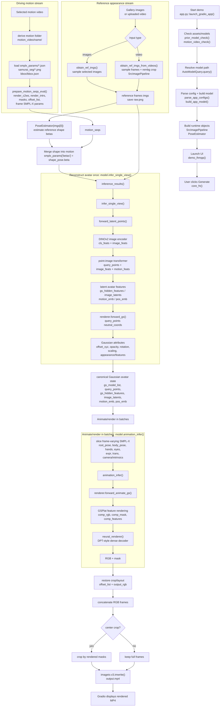
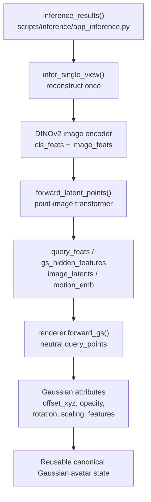
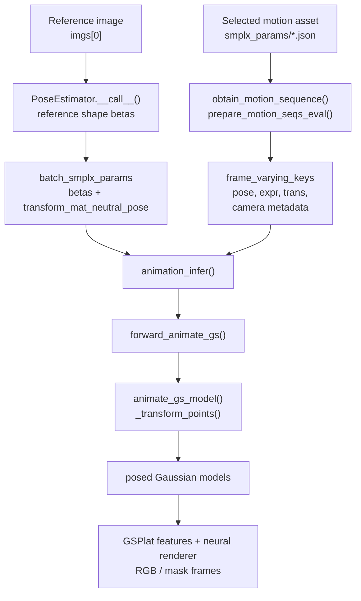

# LHM++ Pipeline Research Notes

本文档是 LHM++ demo / inference path 的研究型阅读笔记：从用户输入 reference images / uploaded video 和 selected driving motion，到 reference shape `betas`、canonical Gaussian avatar reconstruction、SMPL-X-driven animation，最后写出 MP4。重点是 abstraction and clarity：先建立完整 system view，再进入 network design、SMPL-X driving / deformation，以及可验证的 source reading order。

## Executive Summary

- **Reference appearance** 来自 gallery images 或 uploaded video sampled frames，决定 avatar 的 identity、clothing、texture 和 visual appearance。
- **Driving motion** 来自 selected `motion_video/<name>/` asset，提供 per-frame SMPL-X pose / expression / translation / camera / mask metadata。
- `engine/pose_estimation/pose_estimator.py::PoseEstimator.__call__()` 从第一张 reference image 估计 reference shape `betas`，再 graft 到 selected motion sequence 上。
- `scripts/inference/app_inference.py::inference_results()` 先调用 `core/models/modeling_humana4o_lrm.py::infer_single_view()` reconstruct avatar once，得到 reusable canonical Gaussian avatar state。
- `inference_results()` 再按 motion batch 调用 `core/models/modeling_humana4o_lrm.py::animation_infer()`，把 frame-varying SMPL-X / camera data 送入 renderer。
- Network path 可以理解为 DINOv2 image tokens + point-image transformer -> Gaussian attributes -> GSPlat feature rendering -> DPT-style neural renderer。
- SMPL-X driving path 可以理解为 reference shape + motion asset params -> `batch_smplx_params` -> `forward_animate_gs()` / `_transform_points()` -> posed Gaussian models。
- 每个主要 section 都保留 source file / function anchors，方便 researcher 回到 codebase 验证具体 handoff。

## How to read this document

建议先读 `High-Level Flowchart` 建立全局 flowchart，再读 `Stage-by-Stage Data Flow` 和 `Module Interaction Map` 理清 input-to-output data flow。之后按兴趣进入 `Phase 2: Network Design` 理解 DINOv2 / transformer / Gaussian / neural renderer，或进入 `Phase 3: SMPL-X Driving` 理解 `betas`、`frame_varying_keys`、`transform_mat_neutral_pose` 和 posed Gaussian path。最后用 `Source Reading Order` 回到源码逐步验证，遇到 shape 或 config 细节时结合各节 `Caveats` 阅读。

## Scope / Non-goals

本文覆盖：

- main execution entry：`app.py::launch_gradio_app()`、`demo_lhmpp()` / inner `core_fn()`。
- non-UI mirror：`scripts/test/test_app_video.py`。
- input-to-output data flow：reference appearance stream + driving motion stream -> reconstruction -> animation -> MP4。
- module interaction：关键 files / functions / data handoff。
- Mermaid flowchart：清楚区分 reference appearance 和 driving motion。

本阶段不覆盖：

- 训练流程、loss、benchmark、模型质量改进。
- 任何 LHM++ runtime source code 修改。

## Main Execution Entries

### Demo path: `app.py`

主要 demo entry 是 `app.py::launch_gradio_app()`。它完成启动前准备：

1. `prior_model_check()` 检查或下载 prior models。
2. `motion_video_check()` 检查或下载 `motion_video/` assets。
3. `AutoModelQuery.query(model_name)` 解析 LHM++ pretrained model path。
4. `parse_app_configs()` 读取 model config，例如 `configs/train/LHMPP-any-view.yaml`。
5. `build_app_model()` 构建并加载 `ModelHumanA4OLRM`。
6. `PoseEstimator(...)` 加载 reference image shape estimator。
7. `demo_lhmpp()` 启动 Gradio interface。

真正处理一次 Generate 请求的是 `demo_lhmpp()` 内部的 `core_fn()`。可以把 `core_fn()` 看成 demo pipeline orchestrator：它读取用户输入、准备 motion sequence、估计 shape、调用 model inference、最后写出 output video。

### Non-UI mirror: `scripts/test/test_app_video.py`

`scripts/test/test_app_video.py` 是更适合研究阅读的 non-UI mirror。它绕过 Gradio，但复用同一批核心逻辑：

- `prior_model_check()`
- `motion_video_check()`
- `parse_app_configs()`
- `build_app_model()`
- `prepare_input_and_output()`
- `get_motion_information()`
- `PoseEstimator`
- `inference_results()`
- `imageio.v3.imwrite()`

如果想 debug 一次真实 pipeline，又不想被 UI 代码干扰，应优先阅读这个脚本。

## High-Level Flowchart



## Stage-by-Stage Data Flow

| Stage | Source anchor | Input | Output / handoff |
|-------|---------------|-------|------------------|
| Startup / model loading | `app.py::launch_gradio_app()` | CLI `--model_name`, local/downloaded assets | `cfg`, `lhmpp`, `pose_estimator`, `dataset_pipeline` |
| UI callback | `app.py::demo_lhmpp()` -> `core_fn()` | Gradio image/video widgets, motion video, sliders | Starts one inference request |
| Reference input preparation | `core/utils/app_utils.py::prepare_input_and_output()` | gallery images or uploaded video | `imgs`, `raw.png`, `motion_path`, `output.mp4` path |
| Image sampling path | `obtain_ref_imgs()` | selected gallery images | uniformly sampled reference images |
| Video sampling path | `obtain_ref_imgs_from_videos()` | uploaded video | sampled frames, optional `rembg` crop, `SrcImagePipeline` output |
| Motion loading | `core/utils/app_utils.py::get_motion_information()` | selected motion video path | motion name and `motion_seqs` dict |
| Motion JSON loading | `scripts/inference/utils.py::obtain_motion_sequence()` | `motion_video/<name>/smplx_params/*.json` | list of per-frame SMPL-X parameter dicts |
| Motion tensor packaging | `core/runners/infer/utils.py::prepare_motion_seqs_eval()` | SMPL-X dicts, masks, bbox, config | `render_c2ws`, `render_intrs`, `render_bg_colors`, `masks`, `offset_list`, stacked `smplx_params` |
| Reference shape estimation | `engine/pose_estimation/pose_estimator.py::PoseEstimator.__call__()` | first reference image `imgs[0]` | `shape_pose.beta`, assigned to `smplx_params["betas"]` |
| Inference coordinator | `scripts/inference/app_inference.py::inference_results()` | reference tensors + motion tensors + SMPL-X params | RGB frame array |
| Avatar reconstruction | `core/models/modeling_humana4o_lrm.py::infer_single_view()` | reference images, render cameras, SMPL-X shape/motion context | reusable canonical / Gaussian avatar state |
| Animation / rendering | `core/models/modeling_humana4o_lrm.py::animation_infer()` | Gaussian avatar state + frame-varying SMPL-X + cameras | batch RGB and masks |
| Video output | `app.py::core_fn()` with `imageio.v3.imwrite()` | concatenated RGB frames and FPS | final `output.mp4` displayed by Gradio |

## Module Interaction Map

```text
app.py
  launch_gradio_app()
    -> prior_model_check()
    -> motion_video_check()
    -> AutoModelQuery.query()
    -> parse_app_configs()
    -> build_app_model()
    -> PoseEstimator(...)
    -> demo_lhmpp()

  demo_lhmpp()
    -> core_fn()
      -> prepare_input_and_output()
      -> get_motion_information()
      -> PoseEstimator(imgs[0])
      -> inference_results()
        -> ModelHumanA4OLRM.infer_single_view()
        -> ModelHumanA4OLRM.animation_infer()
      -> imageio.v3.imwrite()
```

The important interaction is that `app.py` does not itself implement the model. It is the orchestration layer:

- `core/utils/app_utils.py` owns input and motion preparation.
- `engine/pose_estimation/pose_estimator.py` owns reference shape estimation.
- `scripts/inference/app_inference.py` owns batching and model-call coordination.
- `core/models/modeling_humana4o_lrm.py` owns avatar reconstruction and animation inference.

## Reference Appearance vs Driving Motion

LHM++ demo path has a subtle but important distinction:

- **reference appearance** 是用户上传/选择的 identity and appearance source。它可以来自 gallery images，也可以来自 uploaded video sampled frames。它决定 avatar 看起来像谁、穿什么、纹理/外观是什么。
- **driving motion** 是右侧 motion video selection 对应的 `motion_video/<name>/` folder。它提供 per-frame SMPL-X pose / expression / camera / mask metadata，用来驱动 reconstructed avatar 动起来。

因此，在 demo path 中：

1. uploaded video 不一定是 driving motion；它可以只是 reference appearance source。
2. `PoseEstimator(imgs[0])` 主要从 reference person 估计 body shape `betas`。
3. frame-varying motion 主要来自 selected motion asset 的 `smplx_params/*.json`。
4. `inference_results()` 先 reconstruct avatar once，再按 motion sequence batch-by-batch render。

## Pipeline Narrative

一次 Generate 请求进入 `core_fn()` 后，系统首先调用 `prepare_input_and_output()`。如果用户提供的是多张 reference images，`obtain_ref_imgs()` 会按 `ref_view` 做均匀采样；如果用户提供的是 uploaded video，`obtain_ref_imgs_from_videos()` 会读取视频帧、采样 reference frames，并尝试使用 `rembg` + center crop 让人物区域更规整。这个阶段输出的是 `imgs`，也就是后续模型看到的 reference appearance。

同时，`get_motion_information()` 根据用户选中的 motion video 找到 `motion_video/<name>/smplx_params`，读取每帧 SMPL-X JSON，并结合 `samurai_seg` masks 和 bbox 信息调用 `prepare_motion_seqs_eval()`。这个阶段输出的是渲染所需的 per-frame camera / intrinsic / mask / offset / SMPL-X tensors。

接着 `PoseEstimator(imgs[0])` 从 reference person 的第一张图估计 shape。输出的 `shape_pose.beta` 被写入 `smplx_params["betas"]`，这一步把 reference identity 的 body shape 接到 motion sequence 上。

真正的模型调用由 `inference_results()` 组织。它先调用 `model.infer_single_view()`，用 reference images 和 SMPL-X shape/context 生成 reusable avatar state，例如 `gs_model_list`、`query_points`、`gs_hidden_features`、`image_latents`、`motion_emb`、`pos_emb`。这个阶段可以理解为 canonical Gaussian avatar reconstruction。

之后 `inference_results()` 按 batch 遍历 motion frames，把 `root_pose`、`body_pose`、`jaw_pose`、hands、eyes、`expr`、`trans`、camera intrinsics 等 frame-varying data 切片后传给 `model.animation_infer()`。`animation_infer()` 再调用 renderer / neural renderer，把 canonical avatar 按每帧 SMPL-X motion 渲染成 RGB + mask。

最后，所有 batch 的 RGB frames 被 concat。如果用户启用 center crop，则根据 rendered masks 裁剪主体区域；否则保留完整 frame。`app.py` 使用 `imageio.v3.imwrite()` 写出 `output.mp4`，Gradio 再显示这个视频。

## Phase 2: Network Design

本节展开上面 flowchart 中 `infer_single_view()` 和 `animation_infer()` 两块内部发生的 network design。阅读时可以把它看成一个两阶段系统：第一阶段从 reference images 生成 reusable Gaussian/avatar state；第二阶段把这个 state 放到每一帧 motion/camera 条件下，用 GSPlat feature rendering + DPT-style neural renderer 输出 RGB + mask。



### App-to-render network boundary

`scripts/inference/app_inference.py::inference_results()` 是 network path 的总入口。它先把 `ref_img_tensors` 增加 batch 维度后传入 `model.infer_single_view()`，得到 `gs_model_list`、`query_points`、`transform_mat_neutral_pose`、`gs_hidden_features`、`image_latents`、`motion_emb`，以及可选的 `pos_emb`。随后它把 `transform_mat_neutral_pose` 写回 batched `smplx_params`，再按 frame batch 切分 `root_pose`、`body_pose`、hands、eyes、`expr`、`trans`、camera intrinsics 等 frame-varying keys，调用 `model.animation_infer()` 输出 `batch_rgb` 和 `batch_mask`。

`PoseEstimator` 在 Phase 2 中只作为 context 出现：`engine/pose_estimation/pose_estimator.py::PoseEstimator.__call__()` 从 reference image 估计 reference shape `betas`，让 reconstruction 使用 reference person 的 body shape。Multi-HMR 结构、SMPL-X 参数来源拆分、`transform_mat_neutral_pose` 如何驱动 posed avatar，放到 Phase 3 解释。

### DINOv2 image encoder and image feature tokens

默认 app config `configs/train/LHMPP-any-view.yaml` 使用 `encoder_type: dinov2`、`encoder_model_name: dinov2_vitl14_reg`、`encoder_feat_dim: 1024`。`core/models/modeling_humana4o_lrm.py::_encoder_fn()` 根据 `encoder_type` 选择 `core/models/encoders/dinov2_wrapper.py::Dinov2Wrapper`。

`Dinov2Wrapper.forward()` 把输入 image resize 到 `downsample_ratio = 14` 的倍数，然后调用 DINOv2 backbone，最后把 `outs["x_norm_clstoken"]` 和 `outs["x_norm_patchtokens"]` concat 成 token sequence。直观地说：

- `cls token` 更像 global appearance summary，可被后续 `forward_motionembed()` 汇聚成 `motion_feats` / `motion_emb`。
- `patch tokens` 保留 local appearance / texture / clothing cues，后续成为 point-image transformer 的 `image_feats`。

这里的 DINOv2 背景只需要理解到这个层级：它不是直接输出 final RGB，而是把 reference appearance 转成 dense visual tokens，供后续 query-point latent features 使用。

### forward_latent_points() and point-image transformer

`core/models/modeling_humana4o_lrm.py::forward_latent_points()` 是 reference image tokens 进入 avatar latent space 的核心桥梁。函数 docstring 标注 input image 是 `[B, S, C_img, H_img, W_img]`，其中 `S` 是 reference views。代码先用 `einops.rearrange(image, "B S C H W -> (B S) C H W")` 合并 batch/view，再调用 `forward_encode_image()`。

encoder 输出被拆成：

- `cls_feats = image_feats[:, :1]`
- `image_feats = image_feats[:, 1:]`

随后 `motion_feats = self.forward_motionembed(cls_feats.mean(dim=1, keepdim=True))`，patch tokens 被 reshape 成 `B S P C`。这些 `image_feats`、`motion_feats`、以及 `query_points` 会进入 `forward_transformer()`。默认 config 中 `transformer_type: mm`，`transformer_decoder.type: patch_efficient_pvt_mm_encoder_decoder_dense`，这表示 LHM++ 用 multi-modality point-image transformer 把 image tokens 和 query point representation 融合。

`forward_transformer()` 根据 `latent_query_points_type` 构造 query-point embedding。默认 `configs/train/LHMPP-any-view.yaml` 设置 `latent_query_points_type: e2e_points`，所以 query point feature 由 renderer 提供的 point representation 进入 transformer，而不是只用固定 learnable embedding。最终 `forward_latent_points()` 返回 `query_feats`、`img_feats`、`motion_embs`、`pos_embs`。在 `infer_single_view()` 里，这些分别对应后续的 `latent_points` / `gs_hidden_features`、`image_latents`、`motion_emb`、`pos_emb`。

从表示角度看，point-image transformer 做的是 cross-modal feature transfer：reference image tokens 提供 appearance evidence，query points 提供 avatar 的 3D anchor / sampling positions，motion/global token 提供 coarse condition。输出的 `query_feats` 就是每个 query point 上的 latent avatar feature。

### renderer.forward_gs() and Gaussian attributes

`core/models/modeling_humana4o_lrm.py::infer_single_view()` 在拿到 `latent_points` 后调用 `self.renderer.forward_gs(gs_hidden_features=latent_points, query_points=query_points, smplx_data=smplx_params, additional_features={"image_feats": image_feats, "image": image[:, 0]})`。这里 `latent_points` 就是 Gaussian hidden features，也就是后续 `gs_hidden_features`。

`core/models/rendering/base_gs_render.py::forward_gs()` 的注解把 `gs_hidden_features` 写成 `Float[Tensor, "B Np Cp"]`：`B` 是 batch size，`Np` 是 query points / Gaussian anchors 数量，`Cp` 是 feature channels。它使用 `query_points["neutral_coords"]` 和 SMPL-X context 调用 `query_latent_feat(...)`，把 latent features 对齐到 canonical / neutral query positions，再逐 batch 调用 `forward_gs_attr()`。

`core/models/rendering/gs_renderer.py::forward_gs_attr()` 注释明确 `x: [N, C]`、`query_points: [N, 3]`。它把 per-point latent feature 和 query position 送入 `self.gs_net(...)`，输出 `GaussianAppOutput`。在文档层面可以把 Gaussian attributes 理解成每个 Gaussian anchor 的可渲染参数：`offset_xyz`、opacity、rotation、scaling，以及 RGB / feature appearance。`offset_xyz` 把 neutral query point 微调成更适合 avatar 表面的 Gaussian center；rotation/scaling/opacity/appearance 决定这个 Gaussian 如何被 rasterized。

注意这里仍然是 Phase 2 的 inference-network 视角：`query_points["neutral_coords"]` 是 canonical anchors，详细的 SMPL-X skinning / `_transform_points()` / `animate_gs_model()` 如何把它们变成每帧 posed points，在 Phase 3 深入展开。

### GSPlat feature renderer and DPT-style neural renderer

`core/models/modeling_humana4o_lrm.py::animation_infer()` 对每个 render view/frame 调用 `self.renderer.forward_animate_gs(...)`。在默认 config 中 `gs_rendering: featbacksplat`、`render_features: True`、`neural_renderer.type: patch_4dptonly`、`neural_renderer_input: "feats"`，所以渲染路径不是只输出 raw Gaussian RGB，而是先渲染 learned feature maps，再用 neural renderer 变成 final RGB/mask。

`core/models/rendering/gsplat_renderer.py::GSPlatFeatRenderer.forward_animate_gs()` 先调用 `animate_gs_model()`，把 canonical Gaussian attributes 和 `query_points` 放到当前 frame/view 的 posed space；然后 `_render_views()` 调用 `forward_single_view()`。`forward_single_view()` 使用 `gsplat.rendering.rasterization(...)`，返回 `comp_rgb`、`comp_mask`，并在传入 `features=gs_hidden_features` 时返回 `comp_features`。

之后 `animation_infer()` 根据 `neural_renderer_input` 选择输入。如果是默认 `"feats"`，它调用：

```text
neural_renderer(image_latents, render_results["comp_features"], motion_emb, render_h, render_w, pos_emb_list=pos_emb)
```

`core/models/modeling_humana4o_lrm.py::_build_neural_renderer()` 会把 `patch_4dptonly` 映射到 `core/models/transformer_block/dpt_decoder.py::PatchDPT4DecoderOnly`。这些 DPT-style decoder 类用 patch/token processing 和 `DPTHead` 做 dense prediction：输入是 rendered feature image + reference image latents + motion embedding，输出是 final `predict_rgbs` 和 `predict_masks`。所以 Phase 2 可以把 final rendering 理解成两步：GSPlat 先把 3D Gaussian feature splat 到 2D feature map，DPT-style neural renderer 再把 feature map decode 成可看的 RGB + mask。

### Tensor / representation table

| Representation | Source anchor | Role | Shape / notes |
|----------------|---------------|------|---------------|
| `ref_img_tensors` | `scripts/inference/app_inference.py::inference_results()` | Reference appearance input sent to `infer_single_view()` | Commented as `(N, C, H, W)` before adding batch dimension; effective model input becomes `[B, S, C, H, W]` |
| `image_feats` | `core/models/modeling_humana4o_lrm.py::forward_latent_points()` | DINOv2 patch image tokens used by point-image transformer | Rearranged to `B S P C`; `P` is patch/token count and is config-dependent |
| `image_latents` | `infer_single_view()` return value from `forward_latent_points()` | Image latent tokens passed into `neural_renderer()` during animation | Same conceptual stream as returned `img_feats`; exact layout depends on transformer / DPT config |
| `motion_emb` | `forward_latent_points()` / `inference_results()` | Global/motion-like conditioning derived from class tokens and reused by neural renderer | Built from `cls_feats`; channel dimension is config-dependent |
| `pos_emb` | `forward_latent_points()` / `animation_infer()` | Optional positional embedding for DPT-style decoder variants | May be `None`; only passed when returned by model |
| `query_points` | `renderer.get_query_points()` and `forward_transformer()` | 3D/canonical point representation used as avatar anchors | Dict or tensor depending on `latent_query_points_type`; default app config uses `e2e_points` |
| `query_points["neutral_coords"]` | `core/models/rendering/base_gs_render.py::forward_gs()` | Canonical / neutral coordinates for Gaussian anchors | Annotated by renderer paths as `[B, N, 3]` or per-batch `[N, 3]` |
| `gs_hidden_features` | `infer_single_view()` return value / `forward_gs()` input | Per-query latent features used to predict Gaussian attributes and later render feature maps | Annotated in renderer as `[B, Np, Cp]`; `Np` and `Cp` are model/config-dependent |
| `Gaussian attributes` | `core/models/rendering/gs_renderer.py::forward_gs_attr()` | Renderable Gaussian parameters | Includes `offset_xyz`, opacity, rotation, scaling, and appearance/features via `GaussianAppOutput` |
| `comp_features` | `core/models/rendering/gsplat_renderer.py::forward_single_view()` | GSPlat rasterized feature image consumed by neural renderer | Present when `features` is passed; spatial size follows render height/width |
| `comp_rgb` | `forward_single_view()` | Intermediate GSPlat RGB output | `[H, W, 3]` in renderer comments; may be auxiliary when neural renderer uses feature input |
| `comp_mask` | `forward_single_view()` | Alpha / foreground mask from GSPlat rasterization | `[H, W]` or batched/view-combined form after `_combine_outputs()` |
| `batch_rgb` | `animation_infer()` return consumed by `inference_results()` | Final neural-rendered RGB frames for a batch | Converted to uint8 numpy and concatenated over time |
| `batch_mask` | `animation_infer()` return consumed by `inference_results()` | Final mask frames for optional center crop and output layout | Used to compute crop bounds when `visualized_center=True` |

### Caveats

- 本节解释 inference-network path，不覆盖 training/loss。`configs/train/` 和 model files 里有训练配置、loss、gradient checkpointing 等信息，但 Phase 2 只解释 demo/inference 如何产生 output frames。
- `PoseEstimator` 只作为 reference shape `betas` context 出现；PoseEstimator 自身的 Multi-HMR internals、SMPL-X motion assets 的参数来源、以及 `animate_gs_model()` / `_transform_points()` 的 driving mechanics 属于 Phase 3。
- Tensor shapes 里凡是依赖 config、patch size、render size、reference view 数、query point 类型、或 selected model variant 的部分，都应读作 config-dependent，而不是 LHM++ 所有模型的固定常数。
- DINOv2、GSPlat、DPT-style decoder 都有各自完整的 upstream theory；本文只解释它们在 LHM++ pipeline 中承担的角色。

### Phase 2 source reading order

建议在 Phase 1 的 source reading order 之后继续按这个顺序读：

1. `scripts/inference/app_inference.py::inference_results()`：确认 `infer_single_view()` 返回哪些 reusable state，以及 `animation_infer()` 如何按 batch 消费它们。
2. `core/models/modeling_humana4o_lrm.py::infer_single_view()`：看 reconstruction once 如何调用 `forward_latent_points()` 和 `renderer.forward_gs()`。
3. `core/models/modeling_humana4o_lrm.py::forward_latent_points()`：看 DINOv2 tokens、`cls_feats`、`image_feats`、`motion_feats`、`forward_transformer()` 如何连接。
4. `core/models/encoders/dinov2_wrapper.py::Dinov2Wrapper.forward()` + `configs/train/LHMPP-any-view.yaml`：确认 default DINOv2 encoder config 和 token 输出。
5. `core/models/rendering/base_gs_render.py::forward_gs()`：看 `gs_hidden_features`、`query_points["neutral_coords"]` 如何进入 Gaussian attribute prediction。
6. `core/models/rendering/gs_renderer.py::forward_gs_attr()`：看 per-point features 如何变成 `GaussianAppOutput`。
7. `core/models/rendering/gsplat_renderer.py::GSPlatFeatRenderer.forward_animate_gs()`：看 Gaussian attributes 如何被 GSPlat rasterization 成 `comp_rgb`、`comp_mask`、`comp_features`。
8. `core/models/modeling_humana4o_lrm.py::animation_infer()`：看 `comp_features`、`image_latents`、`motion_emb` 如何进入 `neural_renderer()`。
9. `core/models/transformer_block/dpt_decoder.py`：看 `PatchDPT4DecoderOnly` / `DPTHead` 风格的 dense prediction 如何输出 RGB 和 mask。

## Phase 3: SMPL-X Driving

本节解释 Phase 2 中刻意保留的 SMPL-X driving / deformation 细节：reference person 的 shape 如何进入系统、selected driving motion 的 per-frame 参数如何被 batch 切片，以及 canonical / neutral Gaussian avatar 如何通过 SMPL-X skinning 变成每一帧 posed Gaussian models。核心 source path 是 `scripts/inference/app_inference.py::inference_results()` -> `core/models/modeling_humana4o_lrm.py::infer_single_view()` -> `core/models/modeling_humana4o_lrm.py::animation_infer()` -> `core/models/rendering/base_gs_render.py::forward_animate_gs()`。



### Shape betas vs driving motion parameters

Phase 3 最容易混淆的一点是：`betas` 和 frame-wise SMPL-X motion 并不来自同一个地方。

- **Reference shape `betas`**：demo / test path 会对 reference appearance 的第一张图 `imgs[0]` 调用 `engine/pose_estimation/pose_estimator.py::PoseEstimator.__call__()`。该函数最后返回 `SMPLXOutput(beta=target_human["shape"][0].cpu().numpy(), is_full_body=True)`，所以它估计的是 reference person 的 body shape。换句话说，`PoseEstimator.__call__()` 负责回答“这个 avatar 的人体形状像谁”。
- **Driving motion parameters**：用户右侧选中的 driving motion 会被 `core/utils/app_utils.py::prepare_input_and_output()` 映射到 `motion_video/<name>/smplx_params`，再由 `core/utils/app_utils.py::get_motion_information()` 调用 `scripts/inference/utils.py::obtain_motion_sequence()` 读取 sorted per-frame JSON。`obtain_motion_sequence()` 还会在存在 `flame_params` 时覆盖 / 补充 `expr`、`jaw_pose`、`leye_pose`、`reye_pose`。随后 `core/runners/infer/utils.py::prepare_motion_seqs_eval()` 把 motion SMPL-X params、camera、mask、bbox 和 render metadata 打包成 `motion_seqs`。

因此，Phase 1 中提到的 `smplx_params["betas"] = shape_pose.beta` 是一个 identity / shape graft：系统把 reference person 的 shape 接到 selected motion asset 的 frame-wise pose / expression / camera stream 上。这里的 shape 参数是相对稳定的 per-identity metadata；`root_pose`、`body_pose`、hands、eyes、`expr`、`trans` 等才是随 motion frame 变化的 driving data。

还有一个 config-dependent caveat：`scripts/inference/app_inference.py::inference_results()` 会检查 `model.use_pred_shape_for_render`。如果 `infer_single_view()` 返回 `pred_shape` 且该开关启用，`core/models/modeling_humana4o_lrm.py::smplx_params_with_pred_shape_betas()` 会用 model-predicted shape 覆盖 `betas` 的前若干维用于 rendering；否则 animation 使用传入的 reference-shape `smplx_params_dev["betas"]`。

### frame_varying_keys contract

`scripts/inference/app_inference.py::inference_results()` 先 reconstruct avatar once，然后在 animation loop 中按 `batch_size` 切 motion frames。它先创建静态的 `batch_smplx_params`：

```text
betas
transform_mat_neutral_pose
```

随后定义 `frame_varying_keys`，并在每个 batch 里用 `motion_seq["smplx_params"][key][:, batch_idx:batch_idx + batch_size]` 切出当前 frame window。 practical shape 可以理解成 `[B, T, ...]`：`B` 通常是 app path 里的 batch/person dimension，`T` 是当前 batch 的 frame/view window；后续 `get_single_view_smpl_data()` 还会按 `vidx` 再切成 single-view / single-frame form。具体维度会随 motion asset、config、renderer helper reshape 而变化，所以这里使用 practical / config-dependent notes，而不是给出全局固定常数。

| Key | Contract | Source / provenance | Practical representation and batching |
|-----|----------|---------------------|----------------------------------------|
| `root_pose` | SMPL-X driving | Per-frame motion JSON via `obtain_motion_sequence()` / `prepare_motion_seqs_eval()` | Global/root orientation. Batched as `motion_seq["smplx_params"][key][:, batch_idx:batch_idx + batch_size]`; later used by SMPL-X forward kinematics. |
| `body_pose` | SMPL-X driving | Per-frame motion JSON | Body joint rotations. The renderer comments commonly show body pose as joint axis-angle groups; exact shape is config-dependent after batching and view slicing. |
| `jaw_pose` | SMPL-X driving / face | SMPL-X JSON, optionally replaced by FLAME `posecode[3:]` | Jaw rotation for face/mouth motion; sliced per frame with the same batch window. |
| `leye_pose` | SMPL-X driving / face | SMPL-X JSON, optionally replaced by FLAME `eyecode[:3]` | Left eye pose; carried with frame motion and consumed when composing the full SMPL-X pose. |
| `reye_pose` | SMPL-X driving / face | SMPL-X JSON, optionally replaced by FLAME `eyecode[3:]` | Right eye pose; same batching behavior as `leye_pose`. |
| `lhand_pose` | SMPL-X driving / hands | Per-frame motion JSON | Left-hand pose parameters; later concatenated into the full SMPL-X pose in skinning code. |
| `rhand_pose` | SMPL-X driving / hands | Per-frame motion JSON | Right-hand pose parameters; same frame-window slicing as `lhand_pose`. |
| `trans` | SMPL-X driving / global placement | Per-frame motion JSON | Global translation. In lower-level skinning it is applied when producing final posed coordinates, so it affects where the posed avatar lands in space. |
| `expr` | SMPL-X driving / expression | SMPL-X JSON or FLAME `expcode` override | Facial expression coefficients. Lower-level skinning applies expression offsets before final posed vertices; dimensionality can be config-dependent, often 100 coefficients in this repo's SMPL-X paths. |
| `focal` | render-camera metadata | Motion packaging from camera/intrinsic data | Focal length metadata carried inside `smplx_params` so render intrinsics can stay aligned with the frame window. It is not a body pose parameter. |
| `princpt` | render-camera metadata | Motion packaging from camera/intrinsic data | Principal point metadata. It supports render shape / camera geometry and should be read as camera metadata, not SMPL-X articulation. |
| `img_size_wh` | render-camera / image metadata | Motion packaging from image/crop/render metadata | Image width/height metadata for render/crop alignment. It travels with `frame_varying_keys` because it varies with the prepared motion frame contract, not because it is part of SMPL-X pose. |

这个表的关键 takeaway 是：`frame_varying_keys` 是 implementation-level batching contract，不完全等于 semantic-level SMPL-X pose contract。`root_pose` 到 `expr` 驱动 body / face / hand / translation；`focal`、`princpt`、`img_size_wh` 是 render-camera / image metadata，只是为了让 animation batch 的 camera geometry 和 frame data 同步。

### Neutral query points and transform_mat_neutral_pose

`core/models/modeling_humana4o_lrm.py::infer_single_view()` 是 canonical avatar setup 的关键入口。当 `latent_query_points_type` 以 `e2e_smplx` 或 `e2e_points` 开头时，它会调用 `self.renderer.get_query_points(query_pts_path, smplx_params, device=image.device)`。在 `core/models/rendering/base_gs_render.py::get_query_points()` 中，renderer 调用 SMPL-X skinning model 生成 `query_points`，然后把 `query_points["transform_mat_to_null_pose"]` 写入 `smplx_data["transform_mat_neutral_pose"]`。

在文档层面可以这样理解：

- `query_points["neutral_coords"]` 是 canonical / neutral space 中的 Gaussian anchor positions。Phase 2 已经解释过它们会参与 latent features 和 Gaussian attributes prediction。
- `query_points["transform_mat_to_null_pose"]` 是从 neutral pose 到 zero/null pose 的 transform metadata。
- `transform_mat_neutral_pose` 是同一个 transform 被保存到 `smplx_params` / `smplx_data` 里的名字。它在 `infer_single_view()` 阶段生成，在 `inference_results()` 中被放进 `batch_smplx_params`，然后在每个 animation batch 中复用。

所以 `transform_mat_neutral_pose` 不是一个 frame-by-frame 新估计的 motion 参数。它更像 canonical avatar reconstruction 阶段留下的 deformation map：后续每一帧都需要它来把 neutral query points 接到 target SMPL-X pose 的变换链上。

### From canonical Gaussian avatar to posed Gaussian models

`scripts/inference/app_inference.py::inference_results()` 在调用 `infer_single_view()` 后，会得到 reusable avatar state：`gs_model_list`、`query_points`、`transform_mat_neutral_pose`、`gs_hidden_features`、`image_latents`、`motion_emb` 和可选 `pos_emb`。随后它把 `betas` 和 `transform_mat_neutral_pose` 放进 `batch_smplx_params`，再把当前 frame window 的 `frame_varying_keys` update 进去。

进入 rendering 时，source path 是：

1. `core/models/modeling_humana4o_lrm.py::animation_infer()` 遍历 target views / frames。
2. 每个 view 调用 `self.renderer.get_single_view_smpl_data(smplx_params, view_idx)`，其中 `betas` 和 `transform_mat_neutral_pose` 会保持不按 view 切，其他 pose / expression / camera keys 会切成 `[:, vidx:vidx + 1]`。
3. `animation_infer()` 调用 `core/models/rendering/base_gs_render.py::forward_animate_gs()`。
4. `forward_animate_gs()` 从 `query_points["neutral_coords"]` 取 canonical coordinates，并对每个 batch item 调用 `animate_gs_model()`。
5. `animate_gs_model()` 先整理 SMPL-X data，再调用 `_transform_points()`，随后用 `_compute_rotations()` 更新 Gaussian rotations，最后创建 posed `GaussianModel` list。
6. `_transform_points()` 把 `query_points + gs_attr.offset_xyz` 作为 neutral-space Gaussian centers，展开 `transform_mat_neutral_pose`，并构造包含 `neutral_coords`、`transform_mat_to_null_pose`、`mesh_meta` 的 `points` dict，然后委托给 `transform_to_posed_verts_from_neutral_pose()`。

这就是 conceptual SMPL-X-to-posed-Gaussian bridge：network 预测的是 canonical Gaussian avatar attributes；SMPL-X motion 并不是重新生成 avatar，而是把这些 neutral / canonical Gaussians 通过 skinning/deformation 变换到每帧 posed space。

`core/models/rendering/skinnings/smplx_voxel_skinning.py` 是下层实现细节。它的注释明确 `transform_mat_neutral_pose` 用于 neutral pose -> zero pose；后续 `get_transform_mat_joint()` 会把 zero pose -> image/target pose 的 joint transform 算出来，再组合成 neutral -> posed frame 的 transform。`transform_to_posed_verts_from_neutral_pose()` 还会处理 expression offsets、shape blendshapes、voxel skinning weights、global `trans` 等细节。Phase 3 只需要把这些总结成“lower-level skinning implementation”，不需要展开完整 SMPL-X / LBS 数学推导。

### Phase 3 source reading order

如果目标是专门理解 SMPL-X driving，建议按这个 Source reading order 读：

1. `scripts/inference/app_inference.py::inference_results()`：看 `batch_smplx_params`、`frame_varying_keys`、`transform_mat_neutral_pose` 如何进入 animation batches。
2. `engine/pose_estimation/pose_estimator.py::PoseEstimator.__call__()`：看 reference shape `beta` / `betas` 的来源。
3. `core/utils/app_utils.py::get_motion_information()`：看 selected driving motion 如何定位到 `smplx_params`、mask、bbox。
4. `scripts/inference/utils.py::obtain_motion_sequence()`：看 per-frame SMPL-X JSON 和 optional FLAME expression / jaw / eye overrides 如何加载。
5. `core/runners/infer/utils.py::prepare_motion_seqs_eval()`：看 motion sequence 如何打包成 batched SMPL-X / camera / mask tensors。
6. `core/models/modeling_humana4o_lrm.py::infer_single_view()`：看 canonical avatar setup 如何拿到 `query_points` 和 `transform_mat_neutral_pose`。
7. `core/models/rendering/base_gs_render.py::get_query_points()`：看 `query_points["transform_mat_to_null_pose"]` 如何被保存为 `transform_mat_neutral_pose`。
8. `core/models/modeling_humana4o_lrm.py::animation_infer()`：看 frame-wise SMPL-X slices 如何传给 renderer。
9. `core/models/rendering/base_gs_render.py::forward_animate_gs()`：看 renderer 如何把 query points 和 SMPL-X data 送进 animation path。
10. `core/models/rendering/base_gs_render.py::animate_gs_model()`：看 canonical Gaussian attributes 如何被转换成 posed Gaussian models。
11. `core/models/rendering/base_gs_render.py::_transform_points()`：看 neutral coordinates、`offset_xyz`、`transform_mat_neutral_pose` 如何组成 lower-level transform input。
12. `core/models/rendering/skinnings/smplx_voxel_skinning.py::transform_to_posed_verts_from_neutral_pose()`：只读 conceptual blocks，确认 expression offset、shape blendshape、joint transform、voxel skinning weights、global translation 的实现位置。

### Phase 3 caveats

- 本节使用 practical shape notes。`B`、`T`、joint count、expression dimension、view slicing 可能因 motion data、config、renderer helper 而变化；遇到具体样本时应回到 source / tensor dump 验证。
- `focal`、`princpt`、`img_size_wh` 虽然出现在 `frame_varying_keys` 中，但它们是 render-camera / image metadata，不是 SMPL-X body articulation。
- `smplx_voxel_skinning.py` 里包含完整的 lower-level deformation details，例如 expression offsets、shape blendshapes、LBS-style transforms 和 voxel skinning weights。本文只解释它们在 pipeline 中的位置，不做完整数学 derivation。
- Phase 3 仍然是 documentation-only work：不修改 `app.py`、`core/`、`engine/`、`scripts/` 下的 runtime/model/source files。

## Final Scope Notes

本文档已经把 Phase 1 的 pipeline skeleton、Phase 2 的 network design、Phase 3 的 SMPL-X driving 串成同一份 final research notes。以下条目保留为 scope marker，说明相关内容已在对应 section 中展开：

- Phase 2: `DINOv2 image encoder`、`forward_latent_points()`、point-image transformer、`renderer.forward_gs()`、GSPlat feature renderer、DPT-style neural renderer 的 network design 已在本文上方展开。
- Phase 3: `PoseEstimator` 输出和 motion assets 的 SMPL-X 参数区别、frame-varying keys、neutral query points、`transform_mat_neutral_pose`、`animate_gs_model()`、`_transform_points()`、skinning/deformation 如何驱动 Gaussian avatar，已在本文上方展开。

## Source Reading Order

建议按这个顺序阅读源码：

1. `app.py::launch_gradio_app()`：先看 demo 如何启动和加载模型。
2. `app.py::demo_lhmpp()` / `core_fn()`：看一次 Generate 请求如何串联所有模块。
3. `core/utils/app_utils.py::prepare_input_and_output()`：看 reference appearance 如何准备。
4. `core/utils/app_utils.py::get_motion_information()`：看 selected driving motion 如何定位。
5. `scripts/inference/utils.py::obtain_motion_sequence()`：看 SMPL-X JSON 如何加载。
6. `core/runners/infer/utils.py::prepare_motion_seqs_eval()`：看 motion/camera/mask tensors 如何组织。
7. `engine/pose_estimation/pose_estimator.py::PoseEstimator.__call__()`：看 reference shape `betas` 如何估计。
8. `scripts/inference/app_inference.py::inference_results()`：看 reconstruction once + animation batches 的核心控制流。
9. `core/models/modeling_humana4o_lrm.py::infer_single_view()`：看 canonical avatar state 如何生成。
10. `core/models/modeling_humana4o_lrm.py::animation_infer()`：看 frame-wise animation/rendering 如何调用。
11. `core/models/rendering/base_gs_render.py::forward_animate_gs()` / `animate_gs_model()` / `_transform_points()`：看 neutral Gaussian avatar 如何进入 posed Gaussian path。
12. `core/models/rendering/skinnings/smplx_voxel_skinning.py::transform_to_posed_verts_from_neutral_pose()`：只读 conceptual blocks，确认 lower-level skinning / deformation 的实现位置。

按这个路径读，能先把 system skeleton 建起来，再进入 Phase 2 / Phase 3 的网络和 SMPL-X driving 细节。
