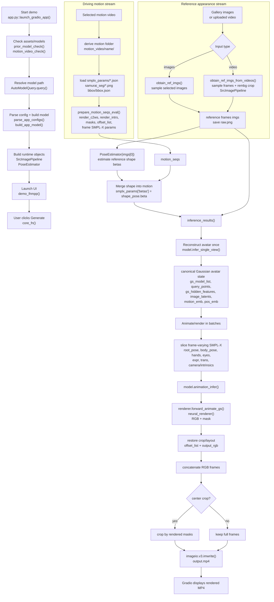

# LHM++ Pipeline Skeleton

本文档解释 LHM++ demo / inference 的高层执行链路：从用户输入 reference images / uploaded video 和 selected driving motion，到最终写出 MP4。重点是 abstraction and clarity：先建立完整 pipeline skeleton，后续 Phase 2 再展开 network design，Phase 3 再展开 SMPL-X driving / deformation 细节。

## Scope / Non-goals

本阶段覆盖：

- main execution entry：`app.py::launch_gradio_app()`、`demo_lhmpp()` / inner `core_fn()`。
- non-UI mirror：`scripts/test/test_app_video.py`。
- input-to-output data flow：reference appearance stream + driving motion stream -> reconstruction -> animation -> MP4。
- module interaction：关键 files / functions / data handoff。
- Mermaid flowchart：清楚区分 reference appearance 和 driving motion。

本阶段不覆盖：

- DINOv2 image encoder、point-image transformer、GS renderer、neural renderer 的详细 network design。
- SMPL-X skinning / deformation / `_transform_points()` 的深入解释。
- 训练流程、loss、benchmark、模型质量改进。
- 任何 LHM++ runtime source code 修改。

## Main Execution Entries

### Demo path: `app.py`

主要 demo entry 是 `app.py::launch_gradio_app()`。它完成启动前准备：

1. `prior_model_check()` 检查或下载 prior models。
2. `motion_video_check()` 检查或下载 `motion_video/` assets。
3. `AutoModelQuery.query(model_name)` 解析 LHM++ pretrained model path。
4. `parse_app_configs()` 读取 model config，例如 `configs/train/LHMPP-any-view.yaml`。
5. `build_app_model()` 构建并加载 `ModelHumanA4OLRM`。
6. `PoseEstimator(...)` 加载 reference image shape estimator。
7. `demo_lhmpp()` 启动 Gradio interface。

真正处理一次 Generate 请求的是 `demo_lhmpp()` 内部的 `core_fn()`。可以把 `core_fn()` 看成 demo pipeline orchestrator：它读取用户输入、准备 motion sequence、估计 shape、调用 model inference、最后写出 output video。

### Non-UI mirror: `scripts/test/test_app_video.py`

`scripts/test/test_app_video.py` 是更适合研究阅读的 non-UI mirror。它绕过 Gradio，但复用同一批核心逻辑：

- `prior_model_check()`
- `motion_video_check()`
- `parse_app_configs()`
- `build_app_model()`
- `prepare_input_and_output()`
- `get_motion_information()`
- `PoseEstimator`
- `inference_results()`
- `imageio.v3.imwrite()`

如果想 debug 一次真实 pipeline，又不想被 UI 代码干扰，应优先阅读这个脚本。

## High-Level Flowchart



## Stage-by-Stage Data Flow

| Stage | Source anchor | Input | Output / handoff |
|-------|---------------|-------|------------------|
| Startup / model loading | `app.py::launch_gradio_app()` | CLI `--model_name`, local/downloaded assets | `cfg`, `lhmpp`, `pose_estimator`, `dataset_pipeline` |
| UI callback | `app.py::demo_lhmpp()` -> `core_fn()` | Gradio image/video widgets, motion video, sliders | Starts one inference request |
| Reference input preparation | `core/utils/app_utils.py::prepare_input_and_output()` | gallery images or uploaded video | `imgs`, `raw.png`, `motion_path`, `output.mp4` path |
| Image sampling path | `obtain_ref_imgs()` | selected gallery images | uniformly sampled reference images |
| Video sampling path | `obtain_ref_imgs_from_videos()` | uploaded video | sampled frames, optional `rembg` crop, `SrcImagePipeline` output |
| Motion loading | `core/utils/app_utils.py::get_motion_information()` | selected motion video path | motion name and `motion_seqs` dict |
| Motion JSON loading | `scripts/inference/utils.py::obtain_motion_sequence()` | `motion_video/<name>/smplx_params/*.json` | list of per-frame SMPL-X parameter dicts |
| Motion tensor packaging | `core/runners/infer/utils.py::prepare_motion_seqs_eval()` | SMPL-X dicts, masks, bbox, config | `render_c2ws`, `render_intrs`, `render_bg_colors`, `masks`, `offset_list`, stacked `smplx_params` |
| Reference shape estimation | `engine/pose_estimation/pose_estimator.py::PoseEstimator.__call__()` | first reference image `imgs[0]` | `shape_pose.beta`, assigned to `smplx_params["betas"]` |
| Inference coordinator | `scripts/inference/app_inference.py::inference_results()` | reference tensors + motion tensors + SMPL-X params | RGB frame array |
| Avatar reconstruction | `core/models/modeling_humana4o_lrm.py::infer_single_view()` | reference images, render cameras, SMPL-X shape/motion context | reusable canonical / Gaussian avatar state |
| Animation / rendering | `core/models/modeling_humana4o_lrm.py::animation_infer()` | Gaussian avatar state + frame-varying SMPL-X + cameras | batch RGB and masks |
| Video output | `app.py::core_fn()` with `imageio.v3.imwrite()` | concatenated RGB frames and FPS | final `output.mp4` displayed by Gradio |

## Module Interaction Map

```text
app.py
  launch_gradio_app()
    -> prior_model_check()
    -> motion_video_check()
    -> AutoModelQuery.query()
    -> parse_app_configs()
    -> build_app_model()
    -> PoseEstimator(...)
    -> demo_lhmpp()

  demo_lhmpp()
    -> core_fn()
      -> prepare_input_and_output()
      -> get_motion_information()
      -> PoseEstimator(imgs[0])
      -> inference_results()
        -> ModelHumanA4OLRM.infer_single_view()
        -> ModelHumanA4OLRM.animation_infer()
      -> imageio.v3.imwrite()
```

The important interaction is that `app.py` does not itself implement the model. It is the orchestration layer:

- `core/utils/app_utils.py` owns input and motion preparation.
- `engine/pose_estimation/pose_estimator.py` owns reference shape estimation.
- `scripts/inference/app_inference.py` owns batching and model-call coordination.
- `core/models/modeling_humana4o_lrm.py` owns avatar reconstruction and animation inference.

## Reference Appearance vs Driving Motion

LHM++ demo path has a subtle but important distinction:

- **reference appearance** 是用户上传/选择的 identity and appearance source。它可以来自 gallery images，也可以来自 uploaded video sampled frames。它决定 avatar 看起来像谁、穿什么、纹理/外观是什么。
- **driving motion** 是右侧 motion video selection 对应的 `motion_video/<name>/` folder。它提供 per-frame SMPL-X pose / expression / camera / mask metadata，用来驱动 reconstructed avatar 动起来。

因此，在 demo path 中：

1. uploaded video 不一定是 driving motion；它可以只是 reference appearance source。
2. `PoseEstimator(imgs[0])` 主要从 reference person 估计 body shape `betas`。
3. frame-varying motion 主要来自 selected motion asset 的 `smplx_params/*.json`。
4. `inference_results()` 先 reconstruct avatar once，再按 motion sequence batch-by-batch render。

## Pipeline Narrative

一次 Generate 请求进入 `core_fn()` 后，系统首先调用 `prepare_input_and_output()`。如果用户提供的是多张 reference images，`obtain_ref_imgs()` 会按 `ref_view` 做均匀采样；如果用户提供的是 uploaded video，`obtain_ref_imgs_from_videos()` 会读取视频帧、采样 reference frames，并尝试使用 `rembg` + center crop 让人物区域更规整。这个阶段输出的是 `imgs`，也就是后续模型看到的 reference appearance。

同时，`get_motion_information()` 根据用户选中的 motion video 找到 `motion_video/<name>/smplx_params`，读取每帧 SMPL-X JSON，并结合 `samurai_seg` masks 和 bbox 信息调用 `prepare_motion_seqs_eval()`。这个阶段输出的是渲染所需的 per-frame camera / intrinsic / mask / offset / SMPL-X tensors。

接着 `PoseEstimator(imgs[0])` 从 reference person 的第一张图估计 shape。输出的 `shape_pose.beta` 被写入 `smplx_params["betas"]`，这一步把 reference identity 的 body shape 接到 motion sequence 上。

真正的模型调用由 `inference_results()` 组织。它先调用 `model.infer_single_view()`，用 reference images 和 SMPL-X shape/context 生成 reusable avatar state，例如 `gs_model_list`、`query_points`、`gs_hidden_features`、`image_latents`、`motion_emb`、`pos_emb`。这个阶段可以理解为 canonical Gaussian avatar reconstruction。

之后 `inference_results()` 按 batch 遍历 motion frames，把 `root_pose`、`body_pose`、`jaw_pose`、hands、eyes、`expr`、`trans`、camera intrinsics 等 frame-varying data 切片后传给 `model.animation_infer()`。`animation_infer()` 再调用 renderer / neural renderer，把 canonical avatar 按每帧 SMPL-X motion 渲染成 RGB + mask。

最后，所有 batch 的 RGB frames 被 concat。如果用户启用 center crop，则根据 rendered masks 裁剪主体区域；否则保留完整 frame。`app.py` 使用 `imageio.v3.imwrite()` 写出 `output.mp4`，Gradio 再显示这个视频。

## What Phase 1 Intentionally Defers

本文档只建立 skeleton。以下内容留给后续阶段：

- Phase 2: `DINOv2 image encoder`、`forward_latent_points()`、point-image transformer、`renderer.forward_gs()`、GSPlat feature renderer、DPT-style neural renderer 的 network design。
- Phase 3: `PoseEstimator` 输出和 motion assets 的 SMPL-X 参数区别、frame-varying keys、neutral query points、`transform_mat_neutral_pose`、`animate_gs_model()`、`_transform_points()`、skinning/deformation 如何驱动 Gaussian avatar。

## Source Reading Order

建议按这个顺序阅读源码：

1. `app.py::launch_gradio_app()`：先看 demo 如何启动和加载模型。
2. `app.py::demo_lhmpp()` / `core_fn()`：看一次 Generate 请求如何串联所有模块。
3. `core/utils/app_utils.py::prepare_input_and_output()`：看 reference appearance 如何准备。
4. `core/utils/app_utils.py::get_motion_information()`：看 selected driving motion 如何定位。
5. `scripts/inference/utils.py::obtain_motion_sequence()`：看 SMPL-X JSON 如何加载。
6. `core/runners/infer/utils.py::prepare_motion_seqs_eval()`：看 motion/camera/mask tensors 如何组织。
7. `engine/pose_estimation/pose_estimator.py::PoseEstimator.__call__()`：看 reference shape `betas` 如何估计。
8. `scripts/inference/app_inference.py::inference_results()`：看 reconstruction once + animation batches 的核心控制流。
9. `core/models/modeling_humana4o_lrm.py::infer_single_view()`：看 canonical avatar state 如何生成。
10. `core/models/modeling_humana4o_lrm.py::animation_infer()`：看 frame-wise animation/rendering 如何调用。

按这个路径读，能先把 system skeleton 建起来，再进入 Phase 2 / Phase 3 的网络和 SMPL-X driving 细节。
